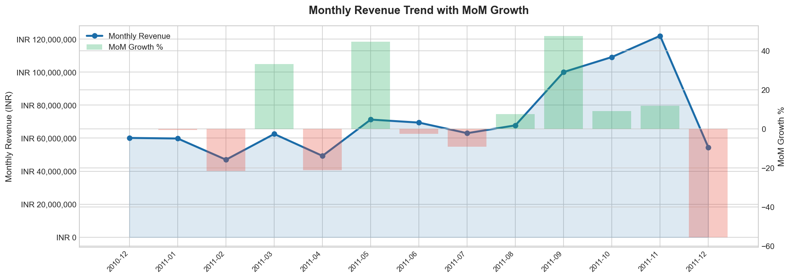
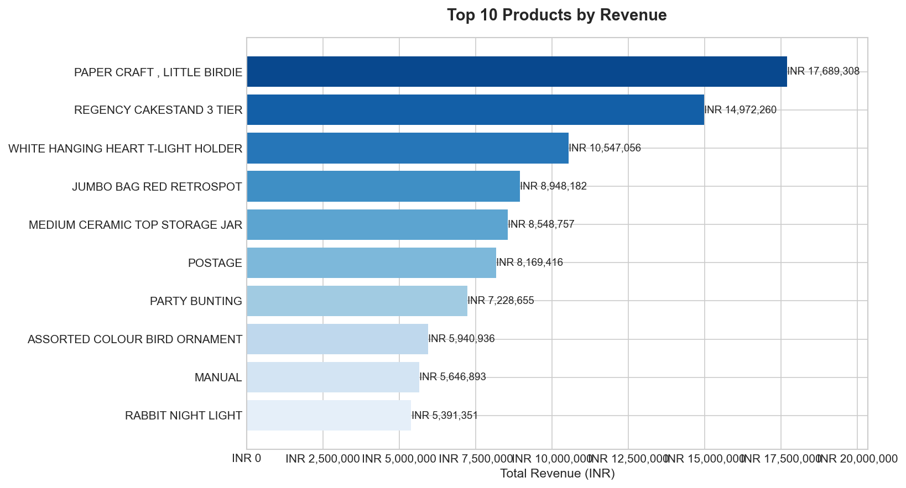
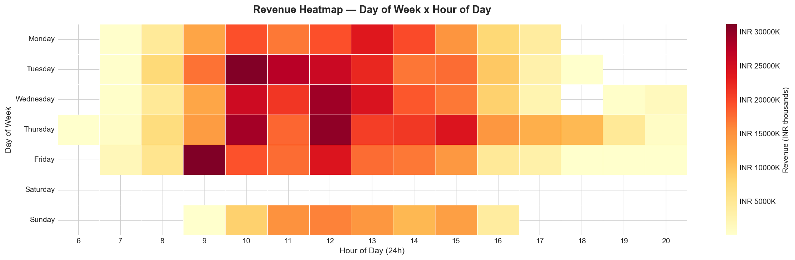

# 🛒 NutriSales Insights Dashboard

**A full-stack data analytics portfolio project simulating an eCommerce Data Analyst workflow.**


## 📌 Project Objective
To transform raw, messy transactional data (541K rows) into actionable business intelligence for a UK-based eCommerce brand. The project demonstrates the complete data pipeline: cleaning raw data with Python, deriving KPIs using SQL window functions, and delivering insights through an interactive Power BI dashboard. Note: Currency metrics are adjusted to INR (₹) for Indian consumer context analysis.

---

## 🚀 Key Findings

* **Overall Performance**: The brand generated **₹935.7 Million** across **18,532 orders**, with an Average Order Value (AOV) of **₹50,490**.
* **Holiday Spike**: November saw the highest revenue, driving a massive **47.65% Month-over-Month (MoM) growth**, aligning with Q4 holiday shopping behaviour.
* **Customer Retention**: Out of 4,338 unique customers, **65.5% returned** for at least a second purchase — a strong indicator of brand loyalty.
* **Geographic Risk**: While the dataset originates from the UK, the data reveals significant concentration. Outside the home market, **Netherlands and EIRE (Ireland)** emerged as the top expansion markets.
* **Sales Timing**: The revenue heatmap indicates peak shopping activity occurs between **10:00 AM and 3:00 PM on Tuesday–Thursday**, highlighting the optimal window for targeted email campaigns.

---

## 🛠️ Tools & Technologies

| Tool | Purpose |
|------|---------|
| **Python** (Pandas) | Data cleaning, handling nulls, type conversion, removing returns |
| **Python** (Seaborn/Plotly) | Exploratory Data Analysis (EDA) and chart generation |
| **SQL** (SQLite) | Business KPI queries (AOV, Retention Cohorts, MoM Growth) |
| **Power BI** | Interactive dashboard creation with DAX measures |
| **Git / GitHub** | Version control and portfolio documentation |

---

## 📊 Exploratory Data Analysis (EDA)

### 1. Monthly Revenue Trend
Identifies seasonal spikes and calculates Month-over-Month (MoM) growth percentage.


### 2. Top 10 Products by Revenue
Highlights the "Hero SKUs" that marketing should prioritize in campaigns.


### 3. Revenue Heatmap (Day x Hour)
Pinpoints the exact time customers are spending the most money.


---

## 💻 Advanced SQL Implementation

The project relies heavily on SQL to generate accurate business metrics. Below is an example of the MoM growth calculation using the `LAG()` window function:

```sql
WITH monthly AS (
    SELECT strftime('%Y-%m', InvoiceDate) AS month,
           ROUND(SUM(Revenue), 2)         AS total_revenue
    FROM sales GROUP BY month
),
growth AS (
    SELECT month, total_revenue,
           LAG(total_revenue) OVER (ORDER BY month) AS prev_revenue
    FROM monthly
)
SELECT month, total_revenue,
       ROUND((total_revenue - prev_revenue) * 100.0 / prev_revenue, 2) AS mom_growth_pct
FROM growth ORDER BY month;
```

---

## 📂 Project Structure

```
nutrisales-insights-dashboard/
│
├── data/                          # Raw & Cleaned CSV data (gitignored)
├── notebooks/                     
│   ├── 00_download_and_clean.py   # Data extraction and cleaning script
│   └── 01_eda.ipynb               # Exploratory Data Analysis notebook
├── sql/
│   └── kpi_queries.sql            # Full suite of business logic queries
├── dashboard/
│   └── NutriSales_Dashboard.pbix  # Power BI Desktop File
├── outputs/                       # Exported charts and summary CSVs
└── logs/
    └── prompt_log.md              # Documentation of decisions and interview prep
```

## 📝 Next Steps (For the User)

1. Open `dashboard/NutriSales_Dashboard.pbix` in Power BI Desktop.
2. If prompted, point the data source to `data/clean_retail.csv`.
3. The dashboard will automatically populate with the INR figures!
